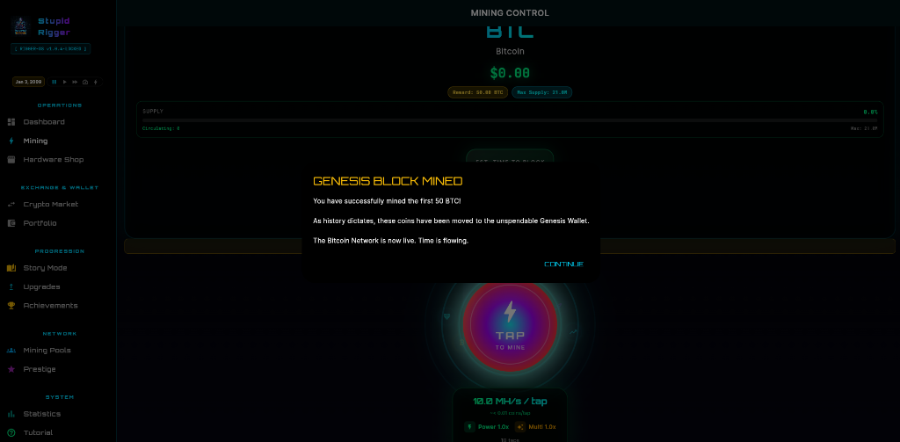
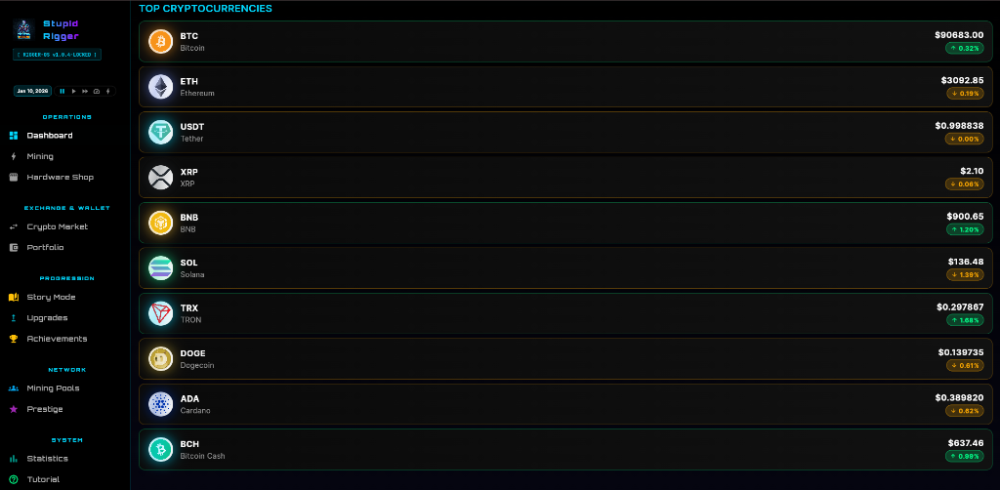
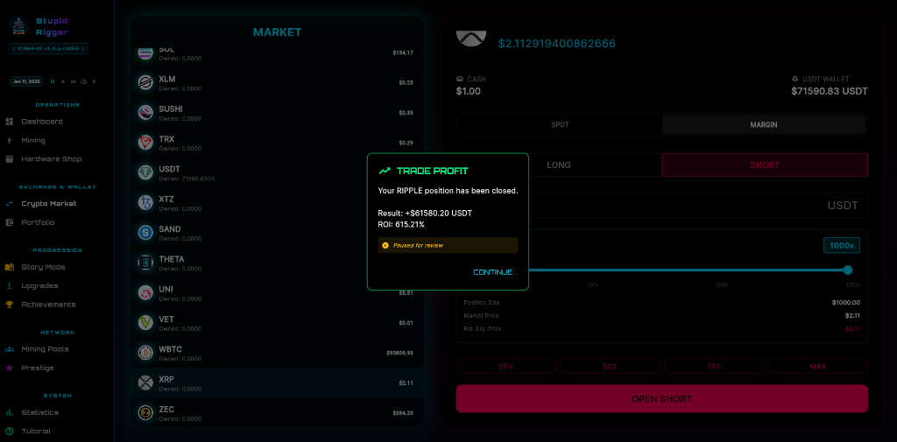
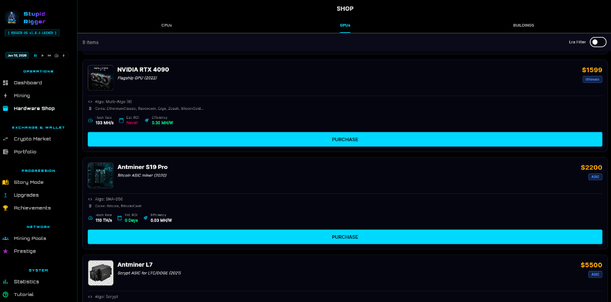

# ⛏️ Stupid Rigger

**A cryptocurrency mining idle game built with Flutter. Mine various cryptocurrencies, buy GPUs, upgrade your mining operation, and watch your crypto portfolio grow!**

<div align="center">

# 🎮 [PLAY THE NEW VERSION HERE](https://unluckvj.xyz/) 🎮
### The playable version of the game is called **Stupid Rigger**
### [https://unluckvj.xyz/](https://unluckvj.xyz/)

</div>

---

## 🎮 Features

*   **Real Mining Calculations**: Uses actual block rewards, network hashrate, and difficulty from WhatToMine API formulas.
*   **25+ Mineable Coins**: Bitcoin, Ethereum, Litecoin, Dogecoin, Monero, Ravencoin, Kaspa, and many more.
*   **Historical Accuracy**: Start in 2009 and play through 15+ years of crypto history, experiencing real market events like the Mt. Gox hack and Bitcoin halvings.
*   **Story Mode**: Follow a guided progression through the history of cryptocurrency.
*   **Empire Building**: Upgrade your location from a Bedroom to a Garage, Warehouse, and eventually a massive Datacenter.
*   **GPU Mining**: Buy and upgrade 50+ historically accurate GPUs and ASICs (from HD 5870 to RTX 4090).
*   **Mining Pools**: Join pools like Slush Pool for consistent rewards.
*   **Trading System**: Spot and Margin trading with up to 1000x leverage.
*   **Prestige System**: Reset your progress for permanent multipliers and bonuses.
*   **Modern UI**: Cyberpunk-themed design with smooth animations.


## 📸 Screenshots


<div align="center">
  
  
  <br/>
  
  
</div>

## 📱 Fully Functional on Mobile
**Stupid Rigger is now optimized for mobile devices!** Experience the full game on Android and iOS with touch-optimized controls and responsive UI.


## 🚀 Getting Started

### Prerequisites

*   Flutter SDK (3.0 or higher): https://flutter.dev/docs/get-started/install
*   Windows development environment (for Windows builds)
*   Git (optional, for cloning)

### Installation

1.  Clone or download this repository:
    ```bash
    git clone https://github.com/luckvj/CryptoMiningEmpire.git
    cd CryptoMiningEmpire
    ```

2.  Install dependencies:
    ```bash
    flutter pub get
    ```

3.  Run the game:
    ```bash
    flutter run -d windows
    ```

## 🎯 How to Play (Tutorial)

### 1. The Beginning (2009)
*   **Start Mining**: You begin on January 3, 2009. Click the big mining button to manually mine your first Bitcoin blocks.
*   **Genesis Block**: Complete the progress bar to mine the Genesis Block.

### 2. Growing Your Operation
*   **Buy Hardware**: Visit the **Shop** to purchase your first GPU (ATI HD 5870). Better hardware means more hashrate.
*   **Manage Power**: Keep an eye on your electricity costs. Upgrade your location to get more power capacity and efficiency.
*   **Time Travel**: The game simulates time at a rate of 1 day per second. Watch your portfolio value change as years pass!

### 3. Advanced Mechanics
*   **Switch Coins**: Navigate to the Mining screen to switch between different cryptocurrencies as they launch (e.g., Litecoin in 2011, Ethereum in 2015).
*   **Trading**: Use the **Trading** tab to buy low and sell high. Watch out for market crashes!
*   **Mining Pools**: Join a pool to reduce variance in your mining rewards.

## 📊 Mining Calculations

All mining calculations use real-world formulas:

*   **Daily Coins** = `(86400 / Block Time) × Block Reward × (Your Hashrate / Network Hashrate)`
*   **Daily Revenue** = `Daily Coins × Exchange Rate`
*   **Daily Profit** = `Daily Revenue - Power Costs`

Data is verified against WhatToMine and CoinGecko formulas.

## 🛠️ Tech Stack

*   **Flutter/Dart**: Cross-platform framework
*   **Provider**: State management
*   **Hive**: Local data persistence
*   **HTTP**: API requests
*   **Google Fonts**: Typography
*   **Flutter Animate**: UI animations

## 📁 Project Structure

```text
lib/
├── core/
│   ├── models/        # Data models (mining data, locations, historical prices)
│   ├── services/      # API services
│   ├── theme/         # App theme and styling
│   └── utils/         # Utility functions
├── providers/         # State management (GameState, CryptoPrice)
├── screens/           # App screens (Home, Mining, Shop, Trading, etc.)
├── widgets/           # Reusable UI components
└── main.dart          # App entry point
```

## 🤝 Contributing

Contributions are welcome! Please feel free to submit a Pull Request.

1.  Fork the repository
2.  Create your feature branch (`git checkout -b feature/AmazingFeature`)
3.  Commit your changes (`git commit -m 'Add some AmazingFeature'`)
4.  Push to the branch (`git push origin feature/AmazingFeature`)
5.  Open a Pull Request

## 📝 License

This project is open source and available under the MIT License.

## 🙏 Acknowledgments

*   **WhatToMine.com**: For providing mining profitability data formulas
*   **CoinGecko**: For cryptocurrency price data
*   **Flutter Community**: For the amazing framework and packages

## 📧 Contact

**Vince** - [@UnLuckvj](https://twitter.com/UnLuckvj)

Project Link: [https://github.com/luckvj/CryptoMiningEmpire](https://github.com/luckvj/CryptoMiningEmpire)

Remember to check out the new version: **[https://unluckvj.xyz/](https://unluckvj.xyz/)**

---
Made with ❤️ and Flutter
